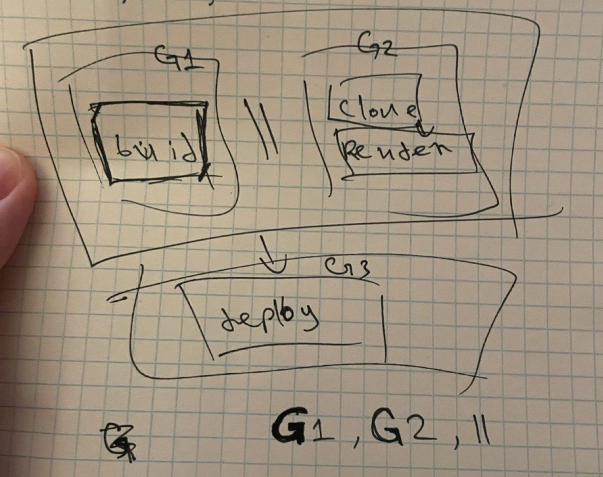

- Перезапуск паникуовавших рутин
- Грейсфул Оставновка
- Увеличение кол-ва воркеров
- Отмена задач
- 

```
пример графа
{
	type: group
	g1: {
		type: group
		g1: {
			type: task
			task: build
			target: single
		}
		g2: {
			type: group
			g1: {
				type: task
				task: clone
			}
			g2: {
				type: task
				task: render
			}
			comp: seq
		}
		comp: par
	},
	g2: {
		type: task
		task: deloy
	},
	comp: seq
}

структура узла графа
el {
	type: group|task
	g1: el
	g2: el
	comp: par|seq
	task: build|clone_config|render_config|deploy
	target: single|all
}
```
## Этот же граф в виде квадратов
